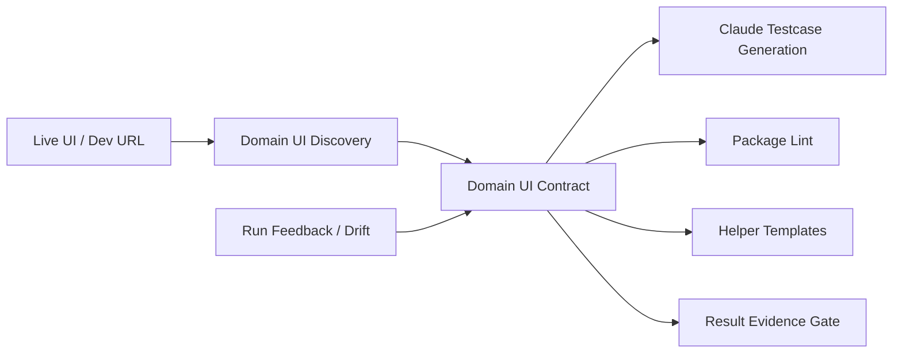

# Domain UI Discovery / UI Contract 綁定 Domain Pack 的想法整理

Date: 2026-05-16 Asia/Taipei
Status: concept note for sharing
Related plan: `docs/planning/domain-ui-contract-helper-gen3-gen4-plan.md`

## 1. 一句話

每個 UAT domain pack 不應只是一組提示詞、xlsx schema 與 locator guidance，而應包含一份由實際 UI 探索產生的 **Domain UI Contract**。這份 contract 會同時服務 testcase 生成、helper templates、package lint、result evidence gate 與後續 drift 修正，讓新 UI 或新功能導入 UAT Tool 時不再靠 agent 臨場猜測。

## 2. 問題背景

這次 BI official UI collage 測試暴露一個典型問題：testcase 寫得人看得懂，但 helper 不一定知道怎麼操作新 UI。

例如 testcase 寫：

```text
加欄位「新增帳號數」(來源:每日報表)
```

對人來說語意清楚；但 official UI 實際操作不是「全頁找到新增帳號數然後點擊」，而是：

1. 進入報表 editor。
2. 找到 metric row。
3. 在同一 row 先選 source report。
4. 等 field picker 對應該 source 載入。
5. 再選 field。
6. 驗證 row 的 source / field 控件文字都已更新。

如果沒有一份 UI contract，Claude 產 testcase、helper 執行 UI、result gate 判斷 evidence 時會各自猜：

- Claude 可能只寫自然語言步驟。
- helper 可能用全頁文字點擊或舊 UI 流程。
- package lint 無法提前知道 testcase 是否可執行。
- result gate 可能只靠文字 regex 判斷 Tool Bridge evidence，造成 false positive。

結果是大量 BLOCKED 不是產品 bug，而是 testcase contract、helper 能力與 evidence contract 沒有對齊。

## 3. 核心概念

`Domain UI Discovery` 是 agent 對新 URL / 新功能 / 大幅 UI 變更做的一次結構化探索。

`Domain UI Contract` 是 discovery 後整理進 domain pack 的穩定資料層。

兩者關係：



重要邊界：

- 不把整份 raw HTML / CSS 當主資料。
- 不讓 domain pack 提交 executable helper code。
- raw DOM、screenshots、accessibility tree 是 artifact。
- 穩定 contract 應是結構化、可 lint、可版本化、可回歸測試的資料。

## 4. 為什麼要跟 Domain Pack 綁定

這份資料不只是給 Claude 產 testcase 用。

它應該屬於 domain pack，因為 domain pack 是該功能的 UAT 可執行規格包。

一個成熟 domain pack 應包含：

```text
Domain Pack =
  Rules
  + UI Contract
  + Action Contract
  + Evidence Schema
  + Helper Templates
  + Locator Registry
  + Lint Rules
  + Feedback / Drift History
```

放在 domain pack 的好處：

- Claude 產 testcase 時有明確 UI 操作模型，不靠想像。
- helper templates 知道 action 要如何落到 UI。
- package lint 可以在跑測前擋掉不可執行 testcase。
- result gate 可以根據 action/evidence state 判斷，不靠全文 regex。
- 後續 UI drift 可以回到同一份 domain contract 更新。

即使未來有整個 Galaxy platform discovery，功能層 domain contract 仍然必要。平台 discovery 可以描述 sidebar、topbar、modal、table 等共用 UI，但無法完整推導某個功能的業務操作語意，例如 BI collage 的 source/field row、日期區間 payload、preview evidence、save/list 驗證與 Tool Bridge 邊界。

## 5. UI Discovery 應產出什麼

建議每次新 domain / 新 URL / UI 大改時產出以下資料：

| 類型 | 內容 | 用途 |
|---|---|---|
| Page map | routes、page title、入口、主要狀態、modal/drawer/popover | 讓 testcase 與 helper 知道可測頁面 |
| Component inventory | form、table、row、picker、date panel、save/delete modal、toast | 定義 domain component 名稱 |
| Locator candidates | role/name、visible label、nearby text、row-local relation、DOM fingerprint | 建立 locator registry |
| Action primitives | open control、select option、assert row text、run preview、capture network | 給 helper template / interpreter 用 |
| State assertions | action 完成後如何驗證，例如 source control 已更新 | 避免聲稱點了但 UI 沒變 |
| Evidence schema | 每個 action 要輸出哪些 DOM/network/chart/screenshot evidence | 讓 result gate 和 detail_json 有一致標準 |
| Hazards | stale picker、loading、disabled、overlay、native dialog | 讓 helper 有 blocker 分類 |

## 6. Domain UI Contract 應長什麼樣

建議 domain pack 增加以下檔案：

```text
domain-packs/<DOMAIN>/
  ui-contract.json
  action-contracts/
    setMetricRows.json
    setDateRange.json
    runPreview.json
    saveReport.json
  helper-templates.json
  evidence-schema.json
  lint-rules.json
  locators/
    official-locator-registry.json
  discovery/
    page-map.json
    component-inventory.json
    locator-candidates.json
    dom-fingerprints.json
    screenshots-manifest.json
```

以 BI official collage 的 `setMetricRows` 為例，contract 應表達的是 UI 操作模型，而不是寫死單一欄位：

```json
{
  "action": "setMetricRows",
  "paramsSchema": {
    "metrics": [
      {
        "sourceReport": "string",
        "field": "string"
      }
    ]
  },
  "steps": [
    {"op": "ensurePage", "page": "collageEditor"},
    {"op": "ensureMetricRow", "rowFrom": "metricIndex"},
    {"op": "selectRowSource", "rowFrom": "metricIndex", "valueFrom": "sourceReport"},
    {"op": "assertRowSource", "rowFrom": "metricIndex", "valueFrom": "sourceReport"},
    {"op": "openRowFieldPicker", "rowFrom": "metricIndex"},
    {"op": "waitForPickerSignatureChange", "target": "fieldPicker"},
    {"op": "selectPickerOption", "valueFrom": "field"},
    {"op": "assertRowField", "rowFrom": "metricIndex", "valueFrom": "field"}
  ],
  "requiredEvidence": [
    "metricRows.before",
    "metricRows.after",
    "sourceControlAfter",
    "fieldControlAfter",
    "locatorAttempts"
  ]
}
```

這樣 testcase 不需要描述 DOM 細節，只要提供 params：

```json
{
  "operationTemplate": "collage_date_variants_preview",
  "params": {
    "metrics": [
      {"sourceReport": "每日報表", "field": "新增帳號數"}
    ],
    "dateVariants": [
      {"uiLabel": "昨日"},
      {"uiLabel": "今日"}
    ],
    "display": "每天"
  }
}
```

## 7. 對 Testcase 生成的改善

Claude 仍然適合負責 testcase 生成，因為它擅長把 PRD、PM 規格、metadata 與測試策略轉成大量 case。

但 Claude 不應自由發明 UI 操作方式。它應根據 domain contract 產出：

- canonical `operationTemplate`
- structured params
- expected evidence
- risk level
- test target
- cleanup state

這會讓 testcase 從「人看得懂」升級成「人看得懂且工具可執行」。

例如舊版：

```json
{
  "sourceReport": "每日報表",
  "field": "新增帳號數"
}
```

應升級為：

```json
{
  "metrics": [
    {"sourceReport": "每日報表", "field": "新增帳號數"}
  ]
}
```

公式 case 也不應只寫：

```json
{
  "baseFields": ["新增帳號數", "MAU(帳號)"]
}
```

應改成：

```json
{
  "baseFields": [
    {"sourceReport": "每日報表", "field": "新增帳號數"},
    {"sourceReport": "每日報表", "field": "MAU(帳號)"}
  ]
}
```

## 8. 對 Helper 的改善

這個方向對 helper 的最大改善是：helper 不再針對自然語言猜 UI。

短期可以先做 compatibility bridge：

- 目前 helper 先支援 `setMetricRows(metrics[])`。
- legacy `field/sourceReport` 仍可接受，但會正規化成 `metrics[]`。
- official UI 使用 row-scoped source + field flow。
- helper 輸出 row evidence 與 picker signature。

中期進入 Gen 3：

- domain pack 提供 domain-driven helper templates。
- capability gate 讀 template capabilities，不靠大量 regex 判斷。
- testcase helper hints 只選 template + params。
- helper 只產 evidence，不判結果。

長期進入 Gen 4：

- stable core 管 session lease、Tool Bridge、artifact、screenshot、DOM/network read、安全 guard。
- action interpreter 只執行 allowlisted declarative actions。
- domain pack 不提交 executable helper code。
- 舊 helper 降成 legacy domain template / plan。

## 9. 對 Result Gate / 上傳契約的改善

result gate 不應靠全文掃 detail_json 來判斷是否缺 Tool Bridge response。

有 action/evidence contract 後，可以改成看 action state：

- save/delete/overwrite/native dialog 真正到達並接受時，才要求 Tool Bridge response。
- preview 或 field setup 失敗導致 save not reached，不要求 save modal / Tool Bridge evidence。
- `預期行為` 提到 Tool Bridge 不代表實際已執行 Tool Bridge action。

範例：

```json
{
  "template": "saveReport",
  "requiredEvidence": ["preview.result", "save.modalState", "projectList.row"],
  "conditionalEvidence": [
    {
      "when": "nativeDialogAccepted",
      "requires": ["toolBridge.response"]
    },
    {
      "when": "preview.notReached",
      "notRequired": ["save.modalState", "toolBridge.response"]
    }
  ]
}
```

這可以直接降低 F-01 類 false positive：case 已在欄位設定階段 BLOCKED，就不應因預期流程包含 save / Tool Bridge 而讓整個 run upload 失敗。

## 10. 對 Package Lint 的改善

目前很多問題是在跑 UI 時才爆。UI Contract 進 domain pack 後，package lint 可以更早擋下：

- preview/date/formula/save template 必須有 `metrics[]`。
- 每個 metric 必須有 `sourceReport` 和 `field`。
- formula `baseFields[]` 必須是 object，不接受純 string。
- `toolBridge.response` 應是 conditional evidence，不能無條件要求。
- `manual_ai` 不應被 helper pre-run 當自動 template 執行。
- template params 必須符合 domain action schema。

這會把錯誤從 runtime blocker 前移到 package authoring 階段。

## 11. 對雲端回饋與持續優化的改善

每次 run 的 helper observations 不應只留在本機。

應回存雲端 artifact：

- action events
- locator attempts
- blocker events
- UI state nodes
- picker source/field signatures
- result gate false-positive report
- operationTemplate + params shape

後續可以產生 drift report：

- 哪些 locator 常失敗。
- 哪些 template params 常缺資料。
- 哪些 picker 有 stale behavior。
- 哪些 result gate regex/contract 造成 false positive。

再由 Codex / reviewer 把候選修正升級進 domain contract。

## 12. 對整體工具的改善點

導入 UI Discovery / UI Contract 後，UAT Tool 的分工會更清楚：

| 角色 | 改善前 | 改善後 |
|---|---|---|
| Claude | 根據 PRD 和想像寫操作步驟 | 根據 domain contract 產 template + params |
| Codex | 跑到 blocker 後臨場修 helper | 先 lint contract，再依 evidence 判定 |
| Helper | 依 hardcoded flow 或文字點擊 | 依 template / declarative action 執行 |
| Package gate | 檢查檔案與基本 schema | 檢查 domain action params 是否可執行 |
| Result gate | 靠文字 regex 判斷 evidence | 根據 action/evidence state 判斷 |
| Domain pack | 提示詞 / schema / locator guidance | 可執行規格包 |

## 13. 建議導入順序

### Phase 1: BI Official Collage v0

- 建立 `ui-contract.json` 草案。
- 補 `setMetricRows(metrics[])` contract。
- 補 result gate false-positive guard。
- 讓 current helper 先照 contract 形狀支援 official row flow。

### Phase 2: Contract-Aware Authoring

- Claude testcase 生成前必讀 domain contract。
- package lint 檢查 `metrics[]`、`baseFields[]`、conditional evidence。
- 新增 domain pack checklist：沒有 UI/action/evidence contract 的正式 UI domain 不進正式跑測。

### Phase 3: Gen 3 Templates

- helper templates 由 domain pack 提供 declarative plan。
- capability gate 讀 template capabilities。
- operationTemplate 變成封閉清單與 schema，而不是自然語言 hint。

### Phase 4: Gen 4 Interpreter

- stable core + allowlisted action interpreter。
- domain pack 不放 executable helper code。
- legacy BI helper 改寫成 legacy template。

### Phase 5: Cloud Feedback Loop

- run feedback 上傳並索引。
- drift report 生成 domain contract update candidates。
- contract update 走 review / smoke / versioning。

## 14. 預期效果

導入後，新增 domain 或 major UI 變更時，流程會從：

```text
Claude 產 testcase -> helper 跑不動 -> Codex 修 helper -> 重跑再發現新問題
```

變成：

```text
UI Discovery -> domain contract -> testcase generation -> package lint -> helper execution -> feedback update
```

這不會讓所有 UI 變更自動無痛，但會把問題從「臨場猜測」變成「可版本化、可驗證、可回饋」。

對 BI official collage 這次的兩個主要問題，幫助是：

- 大量 `新增帳號數` BLOCKED：改由 `setMetricRows(metrics[])` row-scoped contract 解決。
- F-01 result upload false positive：改由 action/evidence contract 判斷 Tool Bridge evidence 是否真的 required。

這是將 UAT Tool 從單次 case runner 推向 domain-driven testing platform 的關鍵一步。
